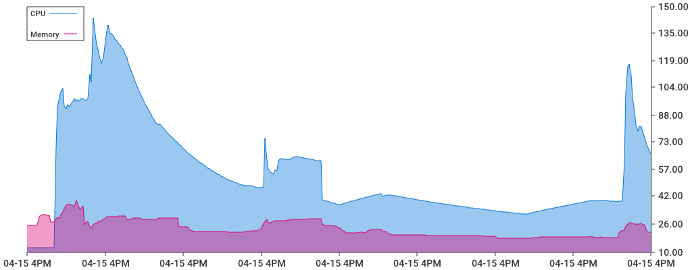

# gops

Gops is a tool to monitor a specific process ressources, it's inspired by [psrecord](github.com/astrofrog/psrecord)



## Installation

1. You can download the latest release [here](https://github.com/sfluor/gops/releases)
2. Or you can install it by building it manually with:
```bash
go get github.com/sfluor/gops
cd $GOPATH/github.com/sfluor/gops
dep ensure
go build
``` 

## Usage

You can monitor firefox usage by doing `gops $(pgrep firefox)` and stop it with `^C` to register firefox resources usage in record.png.